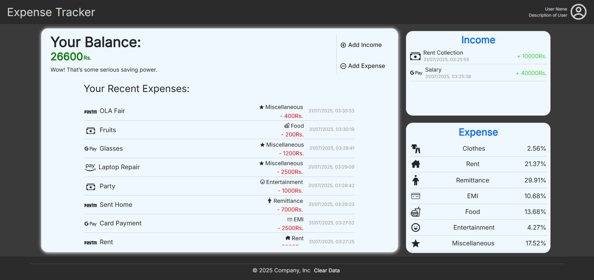
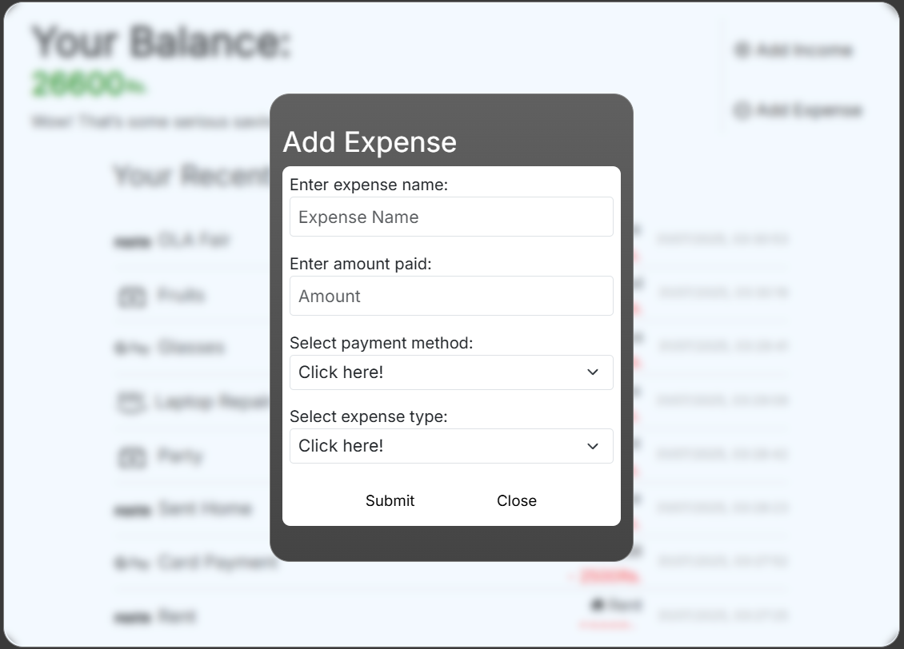
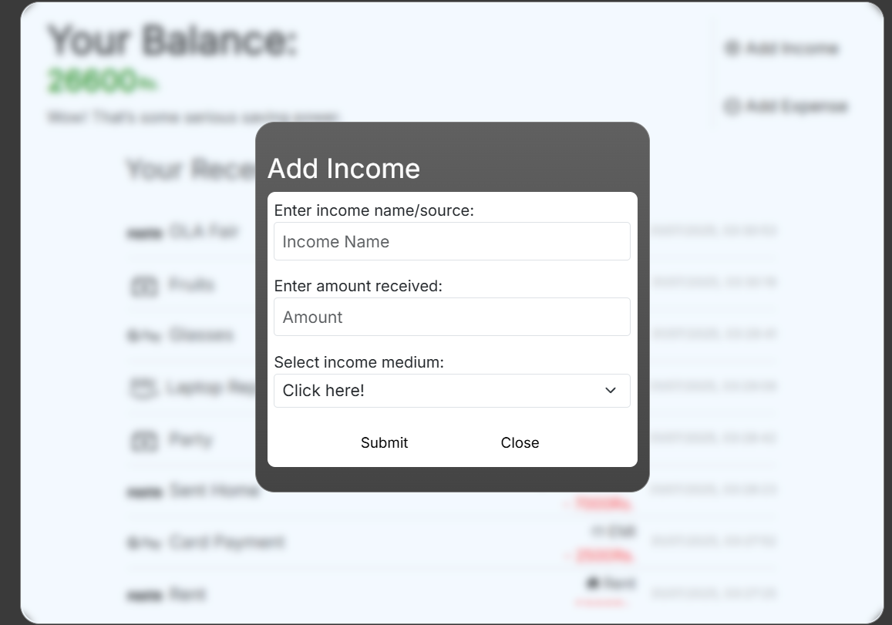
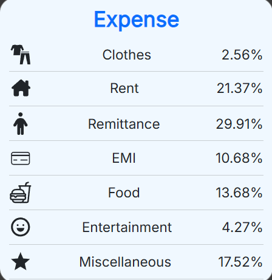
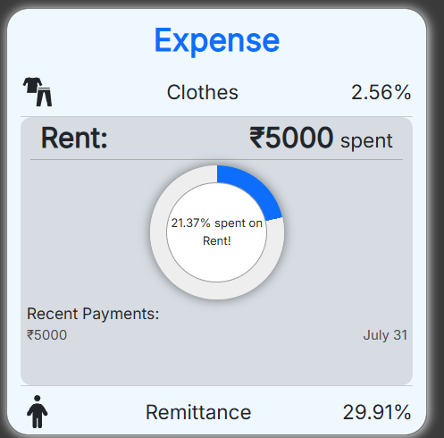

# 💰 Expense Tracker Web App

A responsive web-based expense and income tracker built using **React.js**, **Vite**, and **Bootstrap**.  
Helps users manage their finances by categorizing expenses and displaying income/expense data in a clean, intuitive interface.

---

## 📸 Screenshots

### 🏠 Home Page


### ➖💸 Add Expense


### ➕💰 Add Income


### 📋📊 Expense



---

## 🚀 Features

- ➕ Add new **expenses** and **income**
- 📋 View a detailed list of transactions
- 📂 Categorize expenses (e.g., Food, Travel, Shopping, etc.)
- 📊 Graphical visualization
- 💾 Plan to add persistent **backend data storage**
- 📱 Designed for **desktop** (mobile version may be added later)

---

## 🛠 Tech Stack

- ⚛️ React.js (Frontend Framework)
- ⚡ Vite (Development & Build Tool)
- 🎨 Bootstrap 5 (UI Styling)
- 🔄 Future: Integration with a backend (e.g., Node.js, MongoDB, or Firebase)

---

## 🧪 How to Run Locally

```bash
# Clone the repository
git clone https://github.com/your-username/expense-tracker.git

# Navigate to project folder
cd expense-tracker

# Install dependencies
npm install

# Start development server
npm run dev
